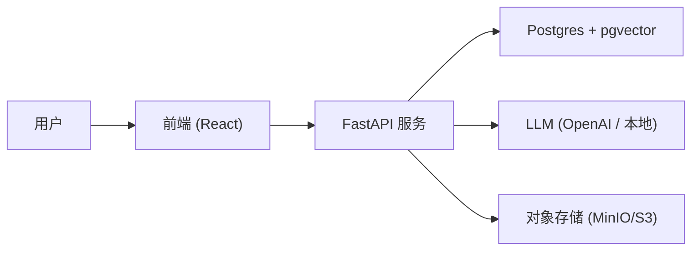

# 🧠 RAG Knowledge Base

> 一个基于 FastAPI + PostgreSQL (pgvector) + 前端 (React) 的 RAG (Retrieval-Augmented Generation) 知识库系统。
> 支持文档上传、语义检索、问答生成、用户反馈与知识库持续优化。

## ✨ 特性

* 📄 文档上传 → 自动切分、向量化存储.
* 🔍 语义检索 → 基于 pgvector 的高效 Top-K 检索
* 🤖 智能问答 → LLM 生成答案，带引用来源
* ⚡ 流式响应 → 支持 SSE/WebSocket，边生成边返回
* 👍 用户反馈 → 点赞/点踩驱动知识库与 Prompt 优化

## 系统架构

